## Практическая работа с Portainer в Docker

> **Portainer** — это легковесная кроссплатформенная управляющая панель с открытым исходным кодом для Docker, Kubernetes и других сред контейнеризации. Она предоставляет удобный веб-интерфейс для управления контейнерами, образами, сетями и томами.

> Никогда в разработке не используйте русские имена файлов и каталогов!
> Никогда в разработке не используйте пробелы и спец.символы в именах файлов и каталогов!

## Этапы

### 1. Подготовка Docker (чтобы начать с "чистого листа")

Перед установкой Portainer я убедилась, что Docker "чист" для удобства дальнейшей работы.

- Проверила наличие всех контейнеров:
```shell
docker ps -a
```
- Остановила все запущенные контейнеры:
```shell
docker stop $(docker ps -q)
```
- Удалила все остановленные контейнеры:
```shell
docker container prune -f
```
- Проверила список образов:
```shell
docker images
```
- Удалила все образы (опционально, для чистоты):
```shell
docker rmi $(docker images -q) -f
```
- Финальная проверка:
```shell
docker ps -a
docker images
```

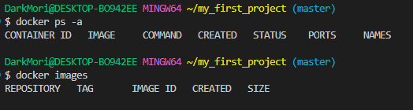

### 2. Установка и запуск Portainer (с сохранением данных)

#### Вариант для Windows (с символами переноса `^`)

Я выполнила команду для создания и запуска контейнера Portainer с томами для сохранения данных:

```shell
docker run -d ^
  --name portainer ^
  -p 9000:9000 ^
  -p 9443:9443 ^
  -v /var/run/docker.sock:/var/run/docker.sock ^
  -v portainer_data:/data ^
  --restart unless-stopped ^
  portainer/portainer-ce:latest
```

**Пояснение параметров:**
- `-d` — запуск в фоновом режиме
- `--name portainer` — имя контейнера
- `-p 9000:9000` — проброс порта для HTTP (веб-интерфейс)
- `-p 9443:9443` — проброс порта для HTTPS
- `-v /var/run/docker.sock...` — подключение к Docker API хоста (позволяет Portainer управлять Docker)
- `-v portainer_data:/data` — создание и подключение тома для хранения данных Portainer
- `--restart unless-stopped` — политика перезапуска контейнера
- `portainer/portainer-ce:latest` — официальный образ Portainer Community Edition

> **Важно для Windows:** Если Docker Desktop использует WSL 2, путь `/var/run/docker.sock` работает корректно. Если возникают проблемы, можно попробовать использовать абсолютный путь `//var/run/docker.sock`.

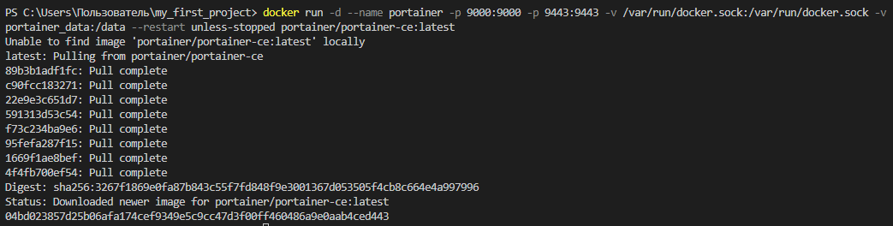

Я проверила, что контейнер создан и запущен:
```shell
docker ps
```

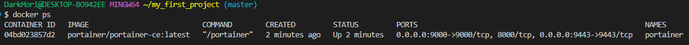

### 3. Первоначальная настройка Portainer

Я подключилась через браузер по адресу [http://localhost:9000](http://localhost:9000)

При первом подключении Portainer предложил создать пользователя-администратора.

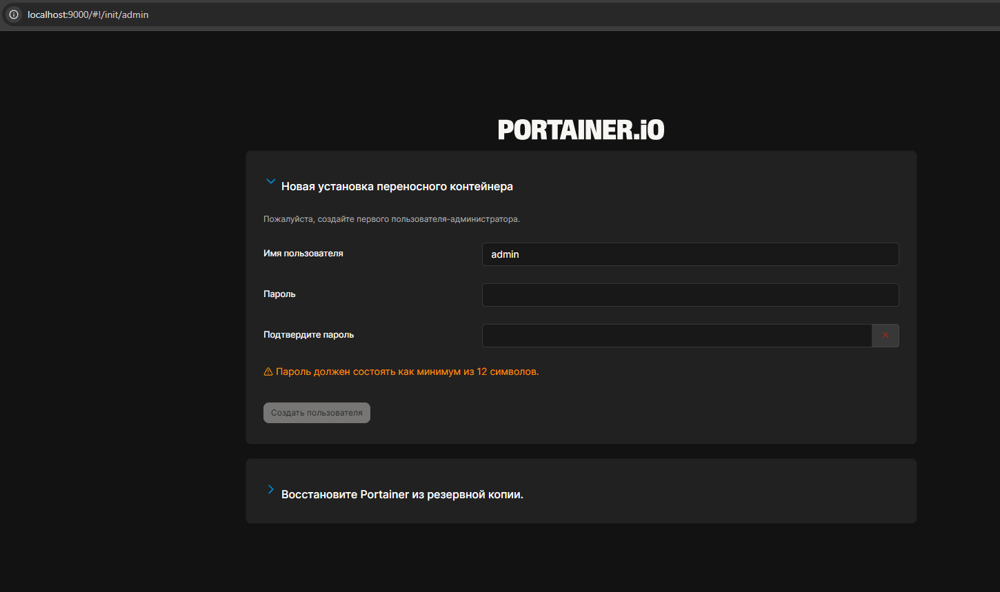

**Процесс настройки:**
1.  Я создала пароль администратора (не менее 12 символов)
2.  Подтвердила пароль
3.  Нажала кнопку "Create user"

После создания пользователя система предложила подключиться к среде Docker. Я выбрала опцию **"Get Started"** для подключения к локальному Docker.

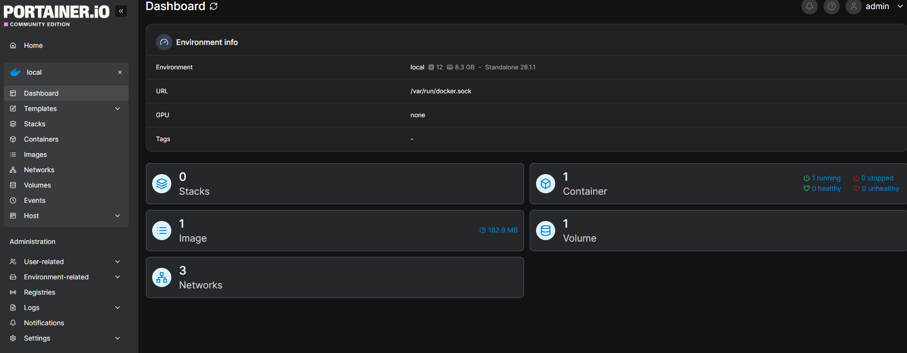

### 4. Главная панель управления (Dashboard)

После подключения я попала на главную панель управления. Я нажала кнопку **Home** в левом меню, чтобы увидеть общий обзор.

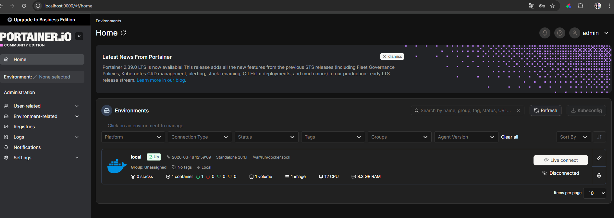

**Dashboard предоставляет информацию:**
- **Общее состояние:** количество запущенных и остановленных контейнеров, образов, сетей, томов
- **Использование ресурсов:** графики использования CPU и памяти
- **Сетевой трафик:** входящий/исходящий трафик
- **Активность дисков:** операции чтения/записи

### 5. Основные возможности Portainer (исследование)

Я изучила основные разделы Portainer, чтобы понять его функциональность.

#### Управление контейнерами (Containers)

Раздел **Containers** позволяет:
- Просматривать все контейнеры (запущенные/остановленные)
- Создавать новые контейнеры (Add container)
- Управлять состоянием: **Start**, **Stop**, **Restart**, **Kill**, **Pause**, **Resume**, **Remove**
- Просматривать логи в реальном времени (**Logs**)
- Открывать терминал (**Console**) внутри контейнера
- Просматривать статистику использования ресурсов (**Stats**)
- Копировать файлы в/из контейнера

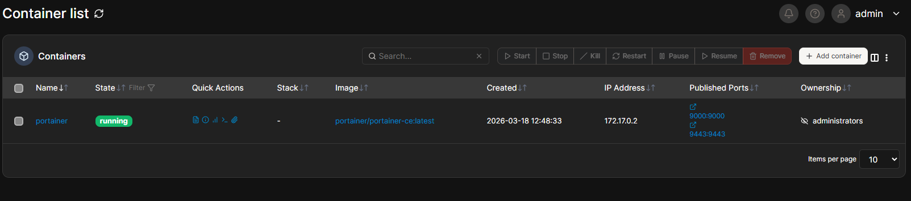

#### Образы (Images)

Раздел **Images** позволяет:
- Просматривать все загруженные образы
- **Pull** новых образов из Docker Hub (например, nginx, httpd, redis)
- Удалять образы
- Собирать образы из Dockerfile (**Build a new image**)
- Импортировать/экспортировать образы

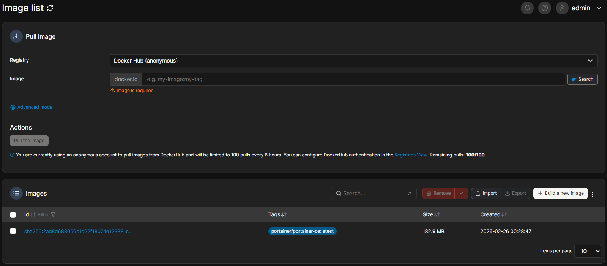

#### Сети (Networks)

Раздел **Networks** позволяет:
- Просматривать все сети Docker
- Создавать пользовательские сети (bridge, overlay, macvlan и др.)
- Подключать/отключать контейнеры к сетям
- Удалять неиспользуемые сети
- Просматривать сетевую топологию

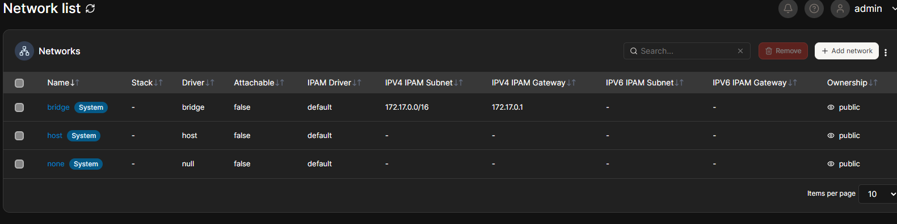

#### Тома (Volumes)

Раздел **Volumes** позволяет:
- Просматривать все созданные тома
- Создавать новые тома для постоянного хранения данных
- Удалять неиспользуемые тома
- Просматривать содержимое томов
- Создавать резервные копии

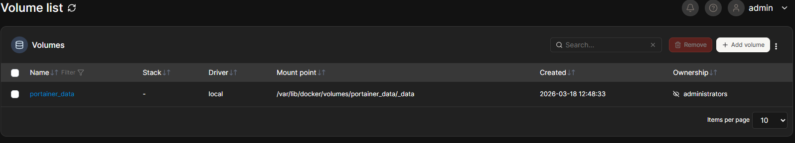
*На скрине видно, что том `portainer_data` был создан автоматически при установке.*

#### Стеки (Stacks)

Раздел **Stacks** позволяет:
- Развёртывать многоконтейнерные приложения с помощью Docker Compose файлов
- Управлять всеми сервисами стека как единым целым
- Просматривать логи и статус каждого сервиса в стеке
- Обновлять стеки с новыми версиями Compose файлов

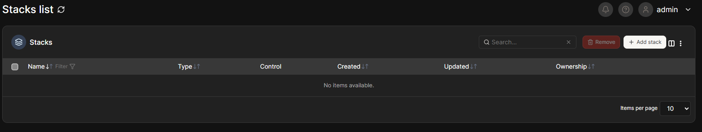

### 6. Практический пример: создание контейнера через Portainer

Чтобы проверить возможности Portainer, я создала новый контейнер Nginx через веб-интерфейс.

1. Перешла в раздел **Containers**
2. Нажала кнопку **"Add container"**
3. Заполнила параметры:
   - **Name:** `nginx-from-portainer`
   - **Image:** `nginx:latest`
   - **Port mapping:** `host: 8083` -> `container: 80`
4. Нажала **"Deploy the container"**

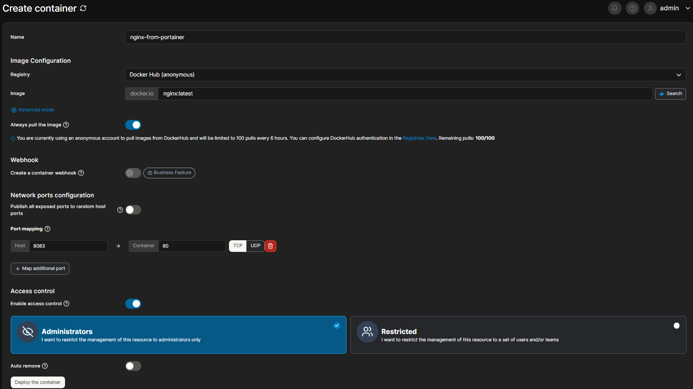

Контейнер был успешно создан и запущен. Я проверила его работу, открыв [http://localhost:8083](http://localhost:8083) в браузере.

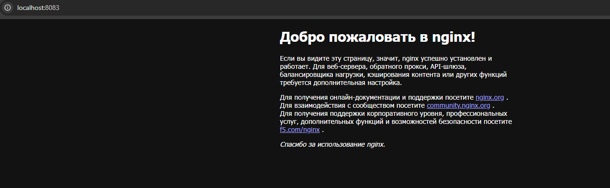

Через интерфейс Portainer я также зашла в логи этого контейнера и открыла терминал (`>_ Console`), выполнив внутри команду `ls -la`.

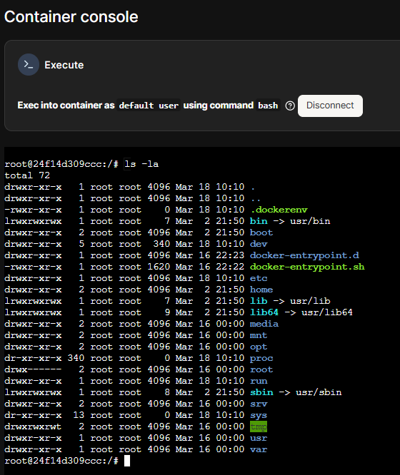

### 7. Удаление Portainer (для завершения эксперимента)

После изучения всех возможностей, я остановила и удалила контейнер Portainer, а также том с данными.

Остановка и удаление контейнера:
```shell
docker stop portainer
docker rm portainer
```

Удаление тома с данными (предварительно убедившись, что данные не нужны):
```shell
docker volume rm portainer_data
```

Проверка, что всё удалено:
```shell
docker ps -a
docker volume ls
```

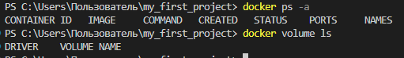

### Выводы

**Portainer — это мощный инструмент для управления Docker, который:**
1. **Упрощает управление** — не нужно помнить все команды Docker CLI
2. **Предоставляет визуализацию** — наглядное отображение всех ресурсов
3. **Ускоряет работу** — создание контейнеров через UI занимает меньше времени
4. **Помогает в отладке** — удобный просмотр логов и доступ к консоли
5. **Подходит для командной работы** — несколько администраторов могут управлять Docker через единый интерфейс

Особенно полезны функции мониторинга ресурсов в реальном времени и возможность управлять томами и сетями через интуитивно понятный интерфейс.

---

### Примечание для пользователей Windows

Если при выполнении команды `docker run` возникают ошибки, проверьте:

1. **Формат переноса строк:** В командной строке Windows (cmd) используйте `^`, в PowerShell используйте `` ` `` (backtick) для переноса строк.
2. **Путь к docker.sock:** В некоторых конфигурациях Windows может потребоваться другой путь. Альтернативный вариант команды для PowerShell:
   ```powershell
   docker run -d `
     --name portainer `
     -p 9000:9000 `
     -p 9443:9443 `
     -v \\.\pipe\docker_engine:\\.\pipe\docker_engine `
     -v portainer_data:/data `
     --restart unless-stopped `
     portainer/portainer-ce:latest
   ```
